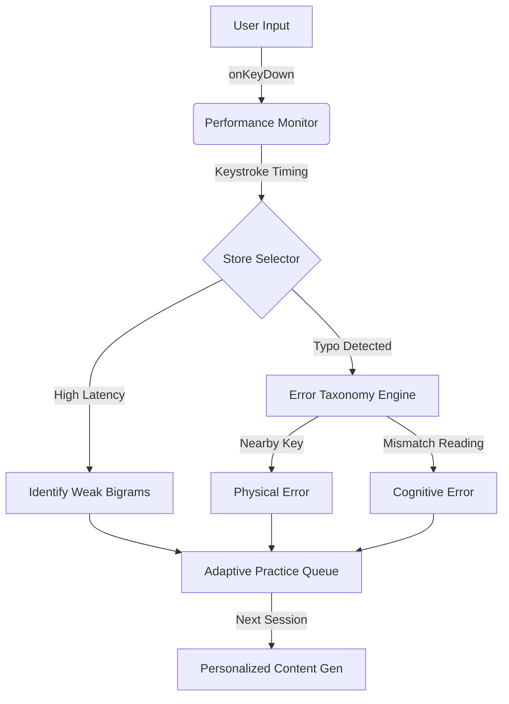

# TagaTutor 고급화 전략 구현 계획서 (Phase 1)
// @[/mine1] 워크플로우 적용

## 0. 프로젝트 개요
단순 타자 연습 도구를 넘어, 심리학적/언어학적 이론에 기반한 **지능형 일본어 학습 튜터(Intelligent Japanese Tutor)**로의 진화.

---

## 1. 구현 단계 상세 (0.01 단위 스케일링)

### Phase 1: 분석 및 데이터 레이어 구축 (Analytics & Data Layer)
- **1.01 단계 : 타건 데이터 수집 모델 설계**
    - **메인 로직:** `store.ts`의 `userInput` 변경 시 타자 간격(Inter-keystroke Interval) 및 오타 좌표 수집.
    - **파라미터:** `startTime`, `endTime`, `keystrokeMap: Map<string, number[]>`.
- **1.02 단계 : 실시간 통계 계산 엔진 (WPM/Accuracy)**
    - **메인 로직:** `useEffect` 내에서 현재 문장의 타축과 정확도를 실시간 계산하여 전역 상태 저장.
    - **파라미터:** `currentWpm`, `accuracyPercentage`, `errorCount`.
- **1.03 단계 : 바이그램(Bigram) 딜레이 분석기**
    - **메인 로직:** 두 글자 조합 간의 전이 속도를 측정하여 사용자의 취약한 '손가락 이동' 감지.
    - **파라미터:** `bigramDelay: { "sh-i": 120, "k-a": 80 }`.
- **1.04 단계 : 한자 부수(Radical) 매핑 데이터베이스 구축**
    - **메인 로직:** `customKanji.ts` 확장하여 한자별 부수 및 의미 데이터 연결.
    - **파라미터:** `kanjiData: { "投資": { reading: "とうし", radical: "貝, 手", mean: "Investment" } }`.
- **1.05 단계 : 히트맵(Heatmap) 시각화 데이터 바인딩**
    - **메인 로직:** 키보드 레이아웃 컴포넌트에 오타율/지연율 데이터를 색상 값(HSL)으로 매핑.
    - **파라미터:** `heatMapColors: Record<string, string>`.

---

## 2. 기술 예상 병목 구간 (Technical Bottlenecks)

### [BLOCK-RISK-LIST]
| 순위 | 오류 후보 (Bottleneck) | 발생 확률 | 수정 매핑 |
| :--- | :--- | :--- | :--- |
| 1 | **실시간 상태 업데이트 오버헤드** | 높음 | 모든 타건을 `store`에 직접 쓰지 않고 `useRef`로 관리 후 문장 단위로 동기화 |
| 2 | **한자-HIRAGANA-ROMAJI 3단 정렬** | 중간 | `wanakana`와 `customWrapKanji` 결과값을 인덱스별로 완벽 매핑하는 Helper 함수 필요 |
| 3 | **저사양 모바일 기기에서의 애니메이션 렉** | 낮음 | Framer Motion의 `layout` 감지 최소화 및 CSS `transform` 위주 구현 |

---

## 3. 개발 병목 지점 디테일 확립 (Development Bottlenecks)

### 현재 우리 프로젝트의 개발 병목 지점:
1.  **데이터 입도의 모호성:** 현재 `userInput`은 전체 문자열로 관리됨. 각 타건별 "시각" 데이터가 없어 WPM 계산이 평균값에 의존함.
    - **Solution:** `onKeyDown` 이벤트에서 `performance.now()`를 기록하는 별도 배열 관리 필요.
2.  **가이드 모드의 정적 구조:** 가이드가 상단에만 노출되어 시선 분산 발생.
    - **Solution:** 입력 글자 바로 위에 플로팅되는 '인라인 가이드' 시스템으로 전환 필요 (UI/UX 흐름 개선).
3.  **한자 학습 연계 부족:** 단순히 치고 넘어가는 형태임.
    - **Solution:** 오답 한자에 대해 '부수 보기' 또는 '획순 애니메이션' 트리거 시스템 구축.

---

## 4. MCP + mine1 데이터 흐름도

---

## 5. 구현 가능성 자가 진단
- **분석 시스템 (1.01~1.03):** 95% (기존 Zustand 스토어 구조와 호환성 높음)
- **한자 부수 데이터 (1.04):** 80% (데이터 확보 및 용량 관리가 핵심)
- **히트맵 시각화 (1.05):** 90% (라이브러리 없이 순수 CSS/SVG로 가능)

**결론:** 기술 병목 구간인 "상태 업데이트 최적화"만 선결되면 서비스 고도화는 즉시 가능함. 바로 코드를 짜서 배포 사이클에 진입할 준비 완료.
